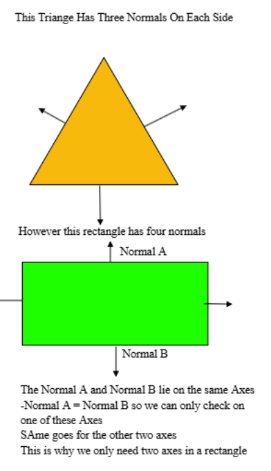

# Every learning resource used for learning SAT
(Incase I forget and need to re-learn this)

First, this video to explain the SAT bascis 
https://www.youtube.com/watch?v=IELWpIGtjRg

After this, I tried to code a function to get corners of the edeges in a rotated rectangle.
Bascially, just read this thread https://stackoverflow.com/questions/41898990/find-corners-of-a-rotated-rectangle-given-its-center-point-and-rotation

And read the getCorners() function, 

After i finally finished the getCorners function, I tried doing the projections.

To fully understand Vector Projections I had to watch this
https://www.youtube.com/watch?v=fqPiDICPkj8

After that, I learnt to get the normal axes (It was ez for rectangles) 
See function getAxes() 

Now, its projections. Goto function project()
struct projection is just min and max projections of the rectangle onto the axes we're checking in. 

isCollidingSAT() applied everything so far

now, MTV (Minimum Translation Vector) it is pretty explainatory at computeMTVSAT()
